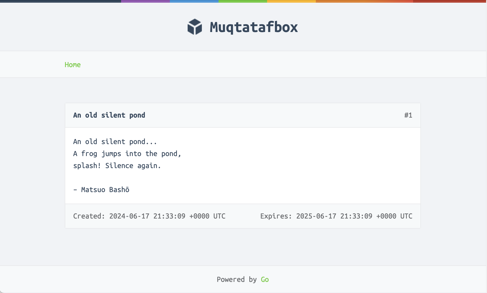

# Muqtatafbox

---

A website that lets people paste and share snippets.

## Table of Contents

- ### [Docs](docs/)

  - **[Tutorials](docs/tutorials/)**
    - **[Running Locally](docs/tutorials/running-locally.md)**
    - **[Connection to the Database](docs/tutorials/connecting-to-database.md)**
  - **[How-Tos](docs/how-tos/)**
    - **[Sending Requests](docs/how-tos/sending-requests.md)**
  - **[Explanations](docs/explanations/)**
    - **[System Design Overview](docs/explanations/system-design-overview.md)**
    - **[Templates](docs/explanations/templates.md/#templates)**
    - **[Structured Logging](docs/explanations/dependency-injection.md/#why-structured-logging)**
    - **[Dependecy Injection](docs/explanations/dependency-injection.md/#dependency-injection)**
    - **[Centralized Error Handling](docs/explanations/dependency-injection.md/#centralized-error-handling)**
  - **[References](docs/references/)**
    - **[Templating](docs/references/templating.md)**

### System Design Overview

### Task List

- [x] Start converting heavy comments to docs
- [ ] System Design Overview
- [ ] Profit
